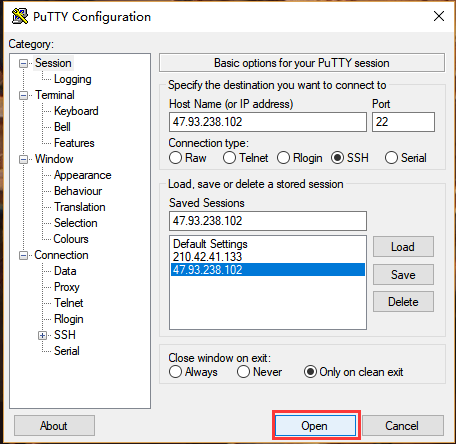

# 微信点餐

目录：

1. [本地文件上传到云服务器](#1)
2. [Git上传文件到中央存储库](#2) 
3. [mysql数据库操作](#3)
4. [tomcat配置外网访问](#4)

一. 本地文件上传到云服务器

  接下来，打开CMD,文件的路径不能有中文名，不能有空格，按照规范命名，命令末尾的root/是云主机的文件夹

---	

二. Git上传文件到中央存储库

1. 单击右键->点击 Git Bash Here，显示如下页面

2. 在E盘中新建文件夹GitTest,文件的路径不能有中文字符，要使用合法的命名规则，GitTest文件夹如下所示：

3. 在Git Bash中输入命令，进入GitTest文件夹 

4. 在浏览器中进入个人的页面中，新建仓库

5. 点击Create repository

6. 在git bash中输入git clone，然后右键paste将刚刚复制的路径粘贴，在文件资源管理器中进入GitTest文件夹中查看，如下图所示：

7. 然后在其中创建一个任意格式，任意名称的文件。如下图所示，我创建了一个名为test的文本文件

8. 当然，也可以从其他文件下复制文件，然后粘贴在这个文件夹下，在git bash中输入ls可查看当前文件夹下的子文件夹，如图所示：

9. 将本地文件上传到中央存储库

10. 查看结果	

---
	

三. mysql数据库操作

1. 开启mysql服务：sqlstart
   查看mysql开启状态：sqlstatus
   关闭mysql服务：sqlstop

   

2. 进入mysql：mysql
   密码：Mysql123.

   

3. 显示数据库：show databases;

   

4. 使用library数据库：use library;
   显示表：show tables;

   

5. 创建数据库和表creat 命令,增删查改均为数据库命令
6. 执行sql文件
   在1.sql中写入
   

   执行
   

---
	

四. tomcat配置外网访问

1. 使用scp命令将代码放入webapps文件夹下

2. 这里创建了一个project文件夹

3. 在里面有一个index.html文件

4. 输入tomcat命令即可运行服务器

5. 输入http://47.93.238.102:8080/project/index.html访问页面

